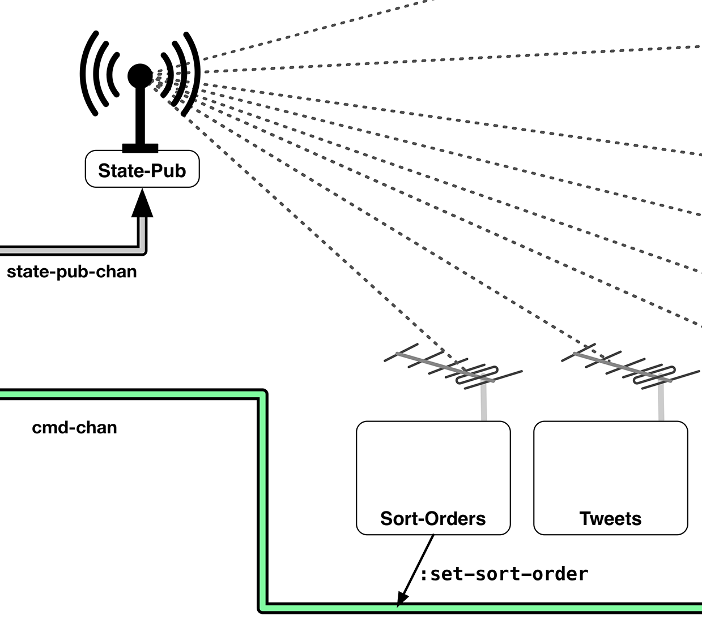

### Interacting with Application State from the UI
There is one major way in which I deviate from the Reagent samples and documentation and that is passing application state to Reagent. As I previously mentioned, I do not like to pass an atom around because it is all too simple to destroy it. When working with UI code, I simply don't want to be able to do that, nor do I want others working on the same codebase to be able to accidentally mutilate the application state from outside a tightly limited state owner.

Luckily, the solution to that is relatively simple. I have already mentioned in the **State** chapter that there's a ````broadcast-state```` function that puts dereferenced application state changes on a channel, which are then broadcasted to interest parties using a **core.async pub**.

All that any of the UI components has to do now is subscribe to this **pub** and ````reset!```` an atom local to the UI component with that new state. Reagent's ````atom```` implementation, which needs to be used here, allows Reagent to detect changes to this atom and re-render accordingly. From Reagent's **[source](https://github.com/reagent-project/reagent/blob/master/src/reagent/core.cljs#L173)**: _"Like clojure.core/atom, except that it keeps track of derefs. Reagent components that derefs one of these are automatically re-rendered."_.

Now using this atom locally is safe, whatever anyone decided to do with it does not affect the state of the application. In order to change the application, the UI component will have to send the state owner a message on the ````cmd-chan````.

Using this approach has an additional advantage. If the UI is a function of the data that involves complex statistical reasoning, we do not necessarily want to trigger a re-render every single time the application state changes as this can easily become too expensive. Instead, I would like to have a way to throttle how often an update occurs. We've already seen part of the solution to that when we sent the dereferenced application state on the ````state-pub-chan````. There, we were using a ````sliding-buffer```` and we can use the same mechanism here again, with the addition of a ````timeout```` inside the ````go-loop```` receiving messages from subscribing to state changes. Let's have a look at this mechanism with a simple example:

```
(defn count-view [app] [:span (:count @app)])

(defn init-count-view
  "Initialize count view view and wire state"
  [state-pub]
  (let [app (atom {})
        state-chan (chan (sliding-buffer 1))]
    (go-loop []
             (let [[_ state-snapshot] (<! state-chan)]
               (reset! app state-snapshot)
               (<! (timeout 10))
               (recur)))
    (sub state-pub :app-state state-chan)
    (r/render-component [count-view app] (util/by-id "tweet-count"))))
```

First in this example, there's a Reagent component called ````count-view````. It only renders a simple ````:span```` with the value of the ````count```` key inside the application state. Next, there's the ````init-count-view```` function which subscribes to the ````state-pub````, creates a local atom, starts a ````go-loop```` that updates the local atom when changes occur and finally initializes the view with the local atom. Notice the usage of the ````sliding-buffer````. Once again, only the latest state change is kept. In addition to that, a ````timeout```` of 10 milliseconds occurs inside the ````go-loop````, which effectively limits the number of updates to a maximum of 100 per second. If more updates occur, the ````go-loop```` will be busy, causing the ````sliding-buffer```` to accept the latest update and drop older ones. Then, when the timeout is up, the ````go-loop```` will always have the latest state message. In this simple case, the ````timeout```` may not be necessary at all, but it becomes more useful when we only want to update the UI every second or even less often when more expensive statistical reasoning needs to be performed before actually rendering the UI.

Here's the part of the architecture drawing that hopefully helps by illustrating the mechanism involved:



For completeness, in order to render this component into the DOM, we need some HTML, with an ````id```` where the element can be rendered:

{lang=html}
```
<div id="count">Tweets: <span id="tweet-count"></span></div>
```

The result of this can be seen on the right side of this screenshot:


