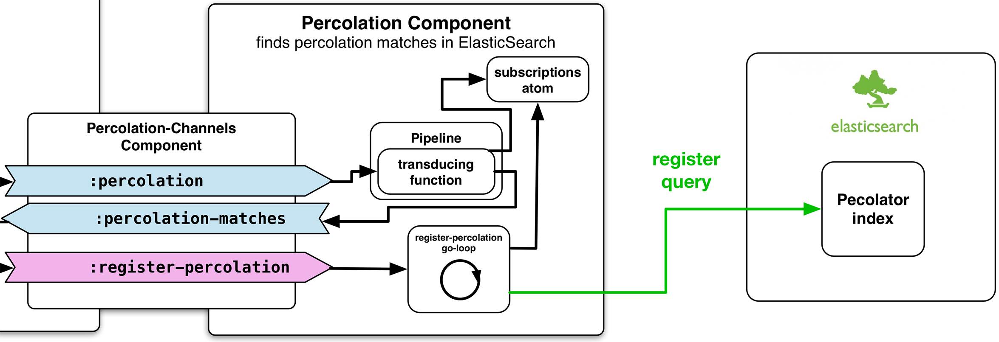

## MainApp - Percolation Component

This component first of all receives registration requests from connected web clients via the ````:register-percolation```` channel. For that, it keeps information about all current ````subscriptions```` in an ````atom````.

The component also receives the ````[t matches]```` vectors on the ````:percolation```` channel. These originate from the ````Percolator```` component inside the **TwitterClient** application, each of which contains a ````map```` with a ````tweet```` plus a ````set```` with the IDs of all the ````matches````.

A transducing function which has access to the ````subscriptions```` atom then passes the vector on, enriched by the dereferenced ````@subscriptions````. This transducing function is used by a ````pipeline```` that takes each item off the ````:percolation```` channel, has the transducing function process each item and then puts the result on the ````:percolation-matches```` channel.



Without further ado, here's the **[code](https://github.com/matthiasn/BirdWatch/blob/43a9c09493257b9c9b5e9e5644df5f67085feb84/Clojure-Websockets/MainApp/src/clj/birdwatch/percolator/component.clj)**:

~~~
(ns birdwatch.percolator.component
  (:gen-class)
  (:require
   [birdwatch.percolator.elastic :as es]
   [clojure.tools.logging :as log]
   [pandect.core :refer [sha1]]
   [clojure.pprint :as pp]
   [clojurewerkz.elastisch.rest :as esr]
   [com.stuartsierra.component :as component]
   [clojure.core.async :as async :refer [chan tap pipeline]]))

(defrecord Percolator [conf channels]
  component/Lifecycle
  (start [component] (log/info "Starting Percolator Component")
         (let [conn (esr/connect (:es-address conf))
               subscriptions (atom {})
               perc-matches-chan (:percolation-matches channels)
               perc-chan (:percolation channels)]
           (pipeline 1 perc-matches-chan (es/percolation-xf subscriptions) perc-chan)
           (es/run-percolation-register-loop (:register-percolation channels) conn subscriptions)
           (assoc component :conn conn :subscriptions subscriptions)))
  (stop [component] (log/info "Stopping Percolator Component") ;; TODO: proper teardown of resources
        (assoc component :conn nil :subscriptions nil)))

(defn new-percolator [conf] (map->Percolator {:conf conf}))

(defrecord Percolation-Channels []
  component/Lifecycle
  (start [component] (log/info "Starting Percolation Channels Component")
         (assoc component :percolation (chan) :register-percolation (chan) :percolation-matches (chan)))
  (stop [component] (log/info "Stop Percolation Channels Component")
        (assoc component :percolation nil :register-percolation nil :percolation-matches nil)))

(defn new-percolation-channels [] (map->Percolation-Channels {}))
~~~

If the explanations above haven't made a lot of sense to you yet, no worries, the **[code](https://github.com/matthiasn/BirdWatch/blob/43a9c09493257b9c9b5e9e5644df5f67085feb84/Clojure-Websockets/MainApp/src/clj/birdwatch/percolator/elastic.clj)** will explain:

~~~
(ns birdwatch.percolator.elastic
  (:gen-class)
  (:require
   [clojure.tools.logging :as log]
   [pandect.core :refer [sha1]]
   [clojure.pprint :as pp]
   [com.matthiasnehlsen.inspect :as inspect :refer [inspect]]
   [clojurewerkz.elastisch.rest.percolation :as perc]
   [clojurewerkz.elastisch.rest.response    :as esrsp]
   [clojure.core.async :as async :refer [<! put! go-loop]]))

(defn start-percolator
  "register percolation search with ID based on hash of the query"
  [{:keys [query uid]} conn subscriptions]
  (let [sha (sha1 (str query))]
    (swap! subscriptions assoc uid sha)
    (perc/register-query conn "percolator" sha :query query)
    (inspect :perc/start-percolator {:query query :sha sha})))

(defn run-percolation-register-loop
  "loop for finding percolation matches and delivering those on the appropriate socket"
  [register-percolation-chan conn subscriptions]
  (go-loop [] (let [params (<! register-percolation-chan)]
                (inspect :perc/params params)
                (start-percolator params conn subscriptions)
                (recur))))

(defn percolation-xf
  "create transducer for adding de-ref'd subscription to percolation result"
  [subscriptions]
  (map (fn [[t matches]] [t matches @subscriptions])))
~~~

In ````run-percolation-loop````, the ````params```` of a **search** are taken off the ````register-percolation-chan```` and the ````start-percolator```` function is called with this map, the connection ````conn```` and the ````subscriptions```` atom. This function then uses ````query```` and ````uid```` from ````params```` to ````swap!```` the ````subscriptions```` atom by ````assoc````ing the ````sha```` hash of a query into the map under the ````uid```` key. In addition, it registers the ````query```` in ElasticSearch's percolator index, with the ````sha```` as the ID.

Finally, the ````percolation-xf```` transducing function, as mentioned above, enriches the vector it receives by adding the dereferenced ````@subscriptions```` in the third position. The **WebsocketComponent** will eventually do the matchmaking, but we will look at that when we discuss the component. Here, we don't need to know any of that, all we need to know is the data structure that's expected down the line. That's what I find so beautiful about using **core.async** in conjunction with the **component** library, as we do in this application.
