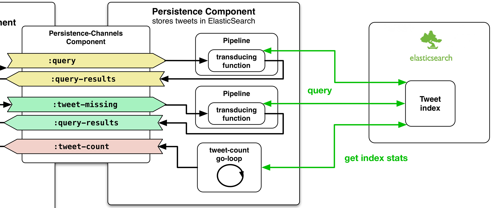

## MainApp - Persistence Component

This component takes care of responding to queries for previous tweets by retrieving them from an index in ElasticSearch so that they can be delivered to the connected web client. It also responds to queries for single tweets that are missing in the user interface. This is not used yet but it will be. Finally, this component runs a loop that frequently sends out stats about the size of the ElasticSearch index that stores all the tweets.



Here's how the **[component](https://github.com/matthiasn/BirdWatch/blob/d104db4a7ac7a745593e34398751f81a50d167d0/Clojure-Websockets/MainApp/src/clj/birdwatch/persistence/component.clj)** looks like:

~~~
(ns birdwatch.persistence.component
  (:gen-class)
  (:require
   [birdwatch.persistence.elastic :as es]
   [clojure.tools.logging :as log]
   [clojure.pprint :as pp]
   [clojurewerkz.elastisch.rest :as esr]
   [com.stuartsierra.component :as component]
   [clojure.core.async :as async :refer [<! chan go-loop tap pipeline-blocking]]))

(defrecord Persistence [conf channels]
  component/Lifecycle
  (start [component]
         (log/info "Starting Persistence Component")
         (let [conn (esr/connect (:es-address conf))
               q-chan (:query channels)
               q-res-chan (:query-results channels)
               mt-chan (:tweet-missing channels)
               mt-res-chan (:missing-tweet-found channels)]
           (pipeline-blocking 4 q-res-chan (es/query-xf conf conn) q-chan)
           (pipeline-blocking 2 mt-res-chan (es/tweet-query-xf conf conn) mt-chan)
           (es/run-tweet-count-loop (:tweet-count channels) conf conn)
           (assoc component :conn conn)))
  (stop [component] ;; TODO: proper teardown of resources
        (log/info "Stopping Persistence Component")
        (assoc component :conn nil)))

(defn new-persistence [conf] (map->Persistence {:conf conf}))

(defrecord Persistence-Channels []
  component/Lifecycle
  (start [component] (log/info "Starting Persistence Channels Component")
         (assoc component
           :query (chan)
           :query-results (chan)
           :tweet-missing (chan)
           :missing-tweet-found (chan)
           :tweet-count (chan)))
  (stop [component] (log/info "Stop Persistence Channels Component")
        (assoc component :query nil :query-results nil :tweet-missing nil :missing-tweet-found nil
                         :tweet-count nil)))

(defn new-persistence-channels [] (map->Persistence-Channels {}))
~~~

Once again, we are using ````pipeline````s and associated transducing functions for taking a query off a channel and putting the result on another channel. In the case of queries for a number of previous tweets, the query is taken off the ````:query```` channel, processed by ````es/query-xf```` and the result put onto the ````:query-results```` channel.

Here is the **[namespace](https://github.com/matthiasn/BirdWatch/blob/3c793a8ded198ba9aa2360f1efb538dd548383b2/Clojure-Websockets/MainApp/src/clj/birdwatch/persistence/elastic.clj)** with the functions that are used in the component:

~~~
(ns birdwatch.persistence.elastic
  (:gen-class)
  (:require
   [birdwatch.persistence.tools :as pt]
   [com.matthiasnehlsen.inspect :as inspect :refer [inspect]]
   [clojure.tools.logging :as log]
   [clojure.pprint :as pp]
   [clojurewerkz.elastisch.rest :as esr]
   [clojurewerkz.elastisch.rest.document :as esd]
   [clojurewerkz.elastisch.query :as q]
   [clojurewerkz.elastisch.rest.response :as esrsp]
   [clojure.core.async :as async :refer [<! <!! chan put! timeout go-loop thread onto-chan]]))

(defn query
  "run a query on previous matching tweets"
  [{:keys [query n from]} conf conn]
  (let [search (esd/search conn (:es-index conf) "tweet" :query query :size n :from from :sort {:id :desc})
        hits (esrsp/hits-from search)
        source (pt/get-source hits)
        res (vec source)]
    res))

(defn query-xf
  "create transducer for answering queries"
  [conf conn]
  (map (fn [q]
         (inspect :elastic/query q)
         {:uid (:uid q) :result (query q conf conn)})))

(defn tweet-query-xf
  "create transducer for finding missing tweets"
  [conf conn]
  (map (fn [req]
         (let [res (esd/get conn (:es-index conf) "tweet" (:id_str req))]
           (inspect :elastic/missing {:req req :res res})
           (when-not res (log/debug "birdwatch.persistence missing" (:id_str req) res))
           {:tweet (pt/strip-source res) :uid (:uid req)}))))

(defn run-tweet-count-loop
  "run loop for sending stats about total number of indexed tweets"
  [tweet-count-chan conf conn]
  (go-loop [] (<! (timeout 10000))
           (let [cnt (esd/count conn (:es-index conf) "tweet")]
             (inspect :elastic/tweet-count cnt)
             (put! tweet-count-chan (format "%,15d" (:count cnt))))
           (recur)))
~~~

The ````query-xf```` transducing function really only calls the ````query```` function and passes the result of that query on in a map that also contains the ````:uid```` of the requesting client. This is kind of the address field on an envelope if you will. The ````query```` function then retrieves tweets from ElasticSearch and runs ````pt/get-source```` on each chunk, which brings the result in the form we need further on. We will look at that briefly below.

The ````tweet-query-xf```` transducing function is comparable to the one above, only that it directly queries ElasticSearch and returns query matches for missing tweets to the correct channel.

Then, there's also the ````run-tweet-count-loop```` function, it runs a ````go-loop```` that gets executed every 10 seconds and then gets the size of the tweet index and puts that on a channel. Eventually, this will be broadcast to all connected web clients for display in the user interface.


Finally, there are additional helper functions in a separate **[namespace](https://github.com/matthiasn/BirdWatch/blob/d104db4a7ac7a745593e34398751f81a50d167d0/Clojure-Websockets/MainApp/src/clj/birdwatch/persistence/tools.clj)**:

~~~
(ns birdwatch.persistence.tools
  (:gen-class))

(defn- strip-tweet
  "take only actually needed fields from tweet"
  [t]
  (let [u (:user t)]
    {:id_str (:id_str t)
     :id (:id t)
     :text (:text t)
     :created_at (:created_at t)
     :retweet_count (:retweet_count t)
     :favorite_count (:favorite_count t)
     :entities (:entities t)
     :user {:followers_count (:followers_count u)
            :name (:name u)
            :profile_image_url (:profile_image_url u)
            :screen_name (:screen_name u)}}))

(defn strip-source
  "get tweet stripped down to necessary fields"
  [val]
  (let [s (:_source val)
        t (strip-tweet s)
        rt (:retweeted_status s)]
    (if rt
      (assoc t :retweeted_status (strip-tweet rt))
      t)))

(defn get-source
  "get vector with :_source of each ElasticSearch result"
  [coll]
  (map strip-source coll))
~~~

All the functions above do is unwrap an ElasticSearch result and strip tweets from all the keys that aren't actually used by the client. Nothing fancy here, only something to reduce the payload size when returning query results via the websocket connection to the client asking for the tweets.
