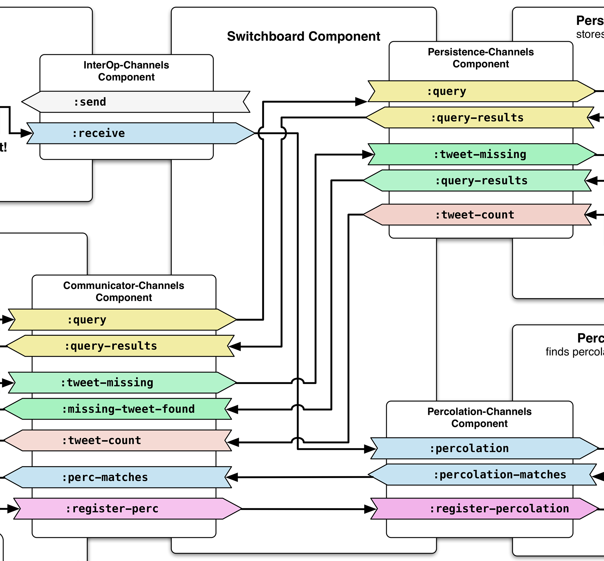

## MainApp - SwitchBoard Component

The ````SwitchBoard```` component is comparable to the one that we saw in the **TwitterClient** application, only with more channels involved.



Let's look at the code:

~~~
(ns birdwatch.switchboard
  (:gen-class)
  (:require
   [clojure.tools.logging :as log]
   [com.stuartsierra.component :as component]
   [clojure.core.async :as async :refer [chan mult tap pipe]]))

;;;; This component is the central switchboard for information flow in this application.
;;;; The individual channel components come together like wiring harnesses in a car.

(defrecord Switchboard [comm-chans pers-chans perc-chans iop-chans]
  component/Lifecycle
  (start [component] (log/info "Starting Switchboard Component")
         (let [tweets-mult (chan)]
           ;; Connect channels 1 on 1. Here, it would be easy to add message logging.
           (pipe (:tweet-count pers-chans) (:tweet-count comm-chans))
           (pipe (:register-perc comm-chans) (:register-percolation perc-chans))
           (pipe (:receive iop-chans) (:percolation perc-chans))
           (pipe (:percolation-matches perc-chans) (:perc-matches comm-chans))
           (pipe (:tweet-missing comm-chans) (:tweet-missing pers-chans))
           (pipe (:missing-tweet-found pers-chans) (:missing-tweet-found comm-chans))
           (pipe (:query comm-chans) (:query pers-chans))
           (pipe (:query-results pers-chans) (:query-results comm-chans))
           (assoc component :tweets-mult tweets-mult)))

  (stop [component] (log/info "Stopping Switchboard Component")
        (assoc component :tweets-mult nil)))

(defn new-switchboard [] (map->Switchboard {}))
~~~

In this component, we only ````pipe```` channels into each other, we thus only facilitate one-on-one connections. When looking at the code right now, I realize that the ````tweets-mult```` is not actually used at all. I remember though that when removing it and reloading the application on the **repl**, the application did not work any longer. Supposedly, that had something to do with the **component** library not recognizing that anything in the component could change and thus holding on to the wrong component instance from the first initialization and with that hold on to channels that aren't in use any longer. But that is just a hunch and probably should be explored further.

