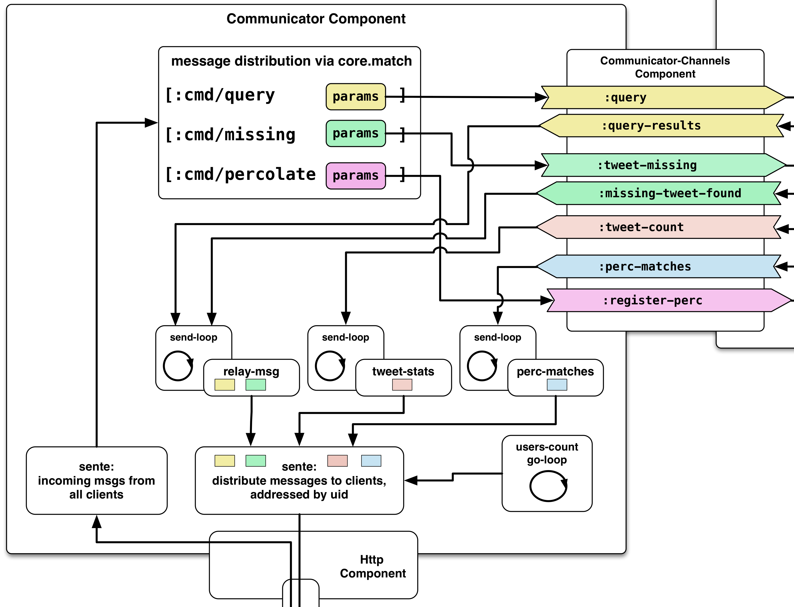

## WebSocket Communication Component

This component handles the interaction with the web clients. It distributes messages coming from WebSocket clients to the appropriate channels of the application and vice versa.



The actual communication over the network is then handled by the HttpComponent which we will look at briefly in the next chapter. Here are the ````Communicator```` and the ````Communicator-Channels``` **[components](https://github.com/matthiasn/BirdWatch/blob/a7a27c76fb4a882daa485d0231de30c1cc078652/Clojure-Websockets/MainApp/src/clj/birdwatch/communicator/component.clj)**:

```
(ns birdwatch.communicator.component
  (:gen-class)
  (:require
   [clojure.pprint :as pp]
   [clojure.tools.logging :as log]
   [birdwatch.communicator.websockets :as ws]
   [taoensso.sente :as sente]
   [taoensso.sente.packers.transit :as sente-transit]
   [com.stuartsierra.component :as component]
   [clojure.core.async :as async :refer [chan]]))

(def packer (sente-transit/get-flexi-packer :json)) ;; serialization format for client<->server comm

(defrecord Communicator [channels chsk-router]
  component/Lifecycle
  (start [component] (log/info "Starting Communicator Component")
         (let [{:keys [ch-recv send-fn ajax-post-fn ajax-get-or-ws-handshake-fn connected-uids]}
               (sente/make-channel-socket! {:packer packer :user-id-fn ws/user-id-fn})
               event-handler (ws/make-handler (:query channels) (:tweet-missing channels) (:register-perc channels))
               chsk-router (sente/start-chsk-router! ch-recv event-handler)]
           (ws/run-users-count-loop send-fn connected-uids)
           (ws/send-loop (:perc-matches channels) (ws/perc-matches connected-uids send-fn))
           (ws/send-loop (:tweet-count channels) (ws/tweet-stats connected-uids send-fn))
           (ws/send-loop (:query-results channels) (ws/relay-msg :tweet/prev-chunk :result send-fn))
           (ws/send-loop (:missing-tweet-found channels) (ws/relay-msg :tweet/missing-tweet :tweet send-fn))
           (assoc component :ajax-post-fn ajax-post-fn
                            :ajax-get-or-ws-handshake-fn ajax-get-or-ws-handshake-fn
                            :chsk-router chsk-router)))
  (stop [component] (log/info "Stopping Communicator Component")
        (chsk-router) ;; stops router loop
        (assoc component :chsk-router nil)))

(defn new-communicator [] (map->Communicator {}))

(defrecord Communicator-Channels []
  component/Lifecycle
  (start [component] (log/info "Starting Communicator Channels Component")
         (assoc component
           :query (chan)
           :query-results (chan)
           :tweet-missing (chan)
           :missing-tweet-found (chan)
           :tweet-count (chan)
           :register-perc (chan)
           :perc-matches (chan)))
  (stop [component] (log/info "Stop Communicator Channels Component")
        (assoc component :query nil :query-results nil :tweet-missing nil
                         :missing-tweet-found nil :tweet-count nil)))

(defn new-communicator-channels [] (map->Communicator-Channels {}))
```

The ````Communicator-Channels```` component has more channels than the other components we've seen so far, but there's really no limit on how many we can use. There's a channel for passing query requests on from clients to some query processor, another channel for results, the same for missing tweets, a channel to send off requests for registering percolation, a channel that frequently delivers stats about the index size in ElasticSearch and a channel that delivers the percolation matches. Note that like in all other components, we don't have to know anything about the implementation of any other component in the system. All we need to know are the channels for interfacing with the outside world.

Here's the associated **[namespace](https://github.com/matthiasn/BirdWatch/blob/3c793a8ded198ba9aa2360f1efb538dd548383b2/Clojure-Websockets/MainApp/src/clj/birdwatch/communicator/websockets.clj)**:

```
(ns birdwatch.communicator.websockets
  (:gen-class)
  (:require
   [clojure.core.match :as match :refer (match)]
   [clojure.pprint :as pp]
   [clojure.tools.logging :as log]
   [taoensso.sente :as sente]
   [com.matthiasnehlsen.inspect :as inspect :refer [inspect]]
   [clojure.core.async :as async :refer [<! >! put! timeout go-loop]]))

(defn user-id-fn
  "generates unique ID for request"
  [req]
  (let [uid (str (java.util.UUID/randomUUID))]
    (log/info "Connected:" (:remote-addr req) uid)
    uid))

(defn make-handler
  "create event handler function for the websocket connection"
  [query-chan tweet-missing-chan register-percolation-chan]
  (fn [{event :event}]
    (match event
           [:cmd/percolate params] (put! register-percolation-chan params)
           [:cmd/query params]     (put! query-chan params)
           [:cmd/missing params]   (put! tweet-missing-chan params)
           [:chsk/ws-ping]         () ; currently just do nothing with ping (no logging either)
           :else                   (log/debug "Unmatched event:" (pp/pprint event)))))

(defn send-loop
  "run loop, call f with message on channel"
  [channel f]
  (go-loop [] (let [msg (<! channel)] (f msg)) (recur)))

(defn tweet-stats
  "send stats about number of indexed tweets to all connected clients"
  [uids chsk-send!]
  (fn [msg] (doseq [uid (:any @uids)]
              (chsk-send! uid [:stats/total-tweet-count msg]))))

(defn perc-matches
  "deliver percolation matches to interested clients"
  [uids chsk-send!]
  (fn [msg]
    (inspect :comm/perc-matches msg)
    (let [[t matches subscriptions] msg]
      (doseq [uid (:any @uids)]
        (when (contains? matches (get subscriptions uid))
          (chsk-send! uid [:tweet/new t]))))))

(defn relay-msg
  "send query result chunks back to client"
  [msg-type msg-key chsk-send!]
  (fn [msg] (chsk-send! (:uid msg) [msg-type (msg-key msg)])))

(defn run-users-count-loop
  "runs loop for sending stats about number of connected users to all connected clients"
  [chsk-send! connected-uids]
  (go-loop [] (<! (timeout 2000))
           (let [uids (:any @connected-uids)]
             (inspect :comm/connected-uids uids)
             (doseq [uid uids] (chsk-send! uid [:stats/users-count (count uids)])))
           (recur)))
```

The ````user-id-fn```` function takes care of generating a random UUID for each new connection.

The ````make-handler```` function takes care of distributing incoming messages from clients over WebSocket connections depending on their type, which is denoted by the first position in a message vector and should be a namespaced keyword. With that, ````core.match```` can put the payload onto the appropriate channels.

The ````send-loop```` function takes care of sending messages from the server to the client. It takes a function to call specific to the message type and a channel to take from. Next, we have functions taking care of specific messages, for example the ````tweet-stats```` function, which delivers the stats to all connected clients whenever a stats message comes in from the ````:tweet-count```` channel.

````perc-matches```` does the matchmaking between percolation matches and clients currently connected and will only deliver a new tweet to a client when that matches the client's search. It is a function that takes the current ````uids```` atom plus the ````chsk-send!```` from **sente** for delivering tweets to individually connected clients. It then returns another function that only takes a message from the ````:perc-matches```` channel and then checks for each current connection if the ````matches```` set contains the ````subscriptions```` map

Finally, we run a loop that frequently (every 2 seconds) broadcasts the number of clients currently connected to all clients.
