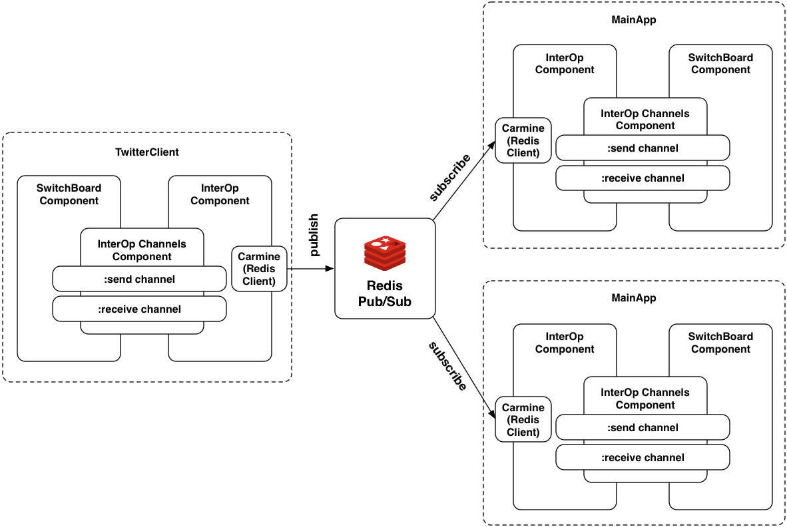

## TwitterClient - InterOp Component
In the "Scaling Out" section of the architectural overview, I drew a picture of how I wanted to break apart the initial monolithic application and instead run different parts of the application in separate processes / separate JVMs. The idea was to have a single client for the connection to the **[Twitter Streaming API](https://dev.twitter.com/streaming/overview)** and the persistence of the received Tweets in **[ElasticSearch](http://www.elasticsearch.com)**, plus multiple machines to serve WebSocket connections to the client. For the communication between the processes, I picked **[Redis Pub/Sub](http://redis.io/topics/pubsub)** because its model of communication suits the requirements really well.

### Redis Pub/Sub with Carmine
I chose **Pub/Sub** over a queue because I wanted to **[fan-out](http://en.wikipedia.org/wiki/Fan-out)** messages to multiple clients. Any connected processes are only supposed to be fed with data during their uptime, with no need to store anything for when they aren't connected. For interfacing with **Redis** from Clojure, I then chose **[Peter Taoussanis](https://twitter.com/ptaoussanis)**'s **[carmine](https://github.com/ptaoussanis/carmine)** client and it turned out to be a great choice.

Let's look at some code. First of all, I am using a **component** that provides a **send channel** and a **receive channel**. It can be reused on either side of the Pub/Sub connection (or for bidirectional communication, of course). Here's the **[code](https://github.com/matthiasn/BirdWatch/blob/4ce6d8ff70359df9f98421c12984d24d0f311f6f/Clojure-Websockets/TwitterClient/src/clj/birdwatch_tc/interop/component.clj)**.
 
{line-numbers=off,lang=clojure}
~~~
(defrecord Interop-Channels []
  component/Lifecycle
  (start [component] (log/info "Starting Interop Channels Component")
         (assoc component :send (chan) :receive (chan)))
  (stop  [component] (log/info "Stop Interop Channels Component")
         (assoc component :send nil :receive nil)))
~~~

This channels component can now be wired into other components. Here's the **[component](https://github.com/matthiasn/BirdWatch/blob/4ce6d8ff70359df9f98421c12984d24d0f311f6f/Clojure-Websockets/TwitterClient/src/clj/birdwatch_tc/interop/component.clj)** on the publisher side:

{line-numbers=off,lang=clojure}
~~~
(defrecord Interop [conf channels]
  component/Lifecycle
  (start [component] (log/info "Starting Interop Component")
         (let [conn {:pool {} :spec {:host (:redis-host conf) :port (:redis-port conf)}}]
           (red/run-send-loop (:send channels) conn "matches")
           (assoc component :conn conn)))
  (stop  [component] (log/info "Stopping Interop Component")
         (assoc component :conn nil)))
~~~

Here, we are creating a configuration map and start a send loop with this configuration for the **"matches"** topic. Here's that loop:

https://github.com/matthiasn/BirdWatch/blob/4ce6d8ff70359df9f98421c12984d24d0f311f6f/Clojure-Websockets/TwitterClient/src/clj/birdwatch_tc/interop/redis.clj

{line-numbers=off,lang=clojure}
~~~
(defn run-send-loop
  "loop for sending items by publishing them on a Redis pub topic"
  [send-chan conn topic]
  (go-loop [] (let [msg (<! send-chan)]
                (car/wcar conn (car/publish topic msg))
                (recur))))
~~~

This **go-loop** consumes all messages that come in on **send-chan** channel and publishes them on **topic** for the specified configuration **conn**.

Here's the other side of the communication with the component subscribing to the same topic. The channels component stays the same. The component itself looks a little different:

https://github.com/matthiasn/BirdWatch/blob/4ce6d8ff70359df9f98421c12984d24d0f311f6f/Clojure-Websockets/MainApp/src/clj/birdwatch/interop/component.clj

{line-numbers=off,lang=clojure}
~~~
(defrecord Interop [conf channels listener]
  component/Lifecycle
  (start [component] (log/info "Starting Interop Component")
         (let [conn {:pool {} :spec {:host (:redis-host conf) :port (:redis-port conf)}}
               listener (red/subscribe-topic (:receive channels) conn "matches")]
           (assoc component :conn conn :listener listener)))
  (stop  [component] (log/info "Stopping Interop Component")
         (red/unsubscribe listener)
         (red/close listener)
         (assoc component :conn nil :listener nil)))
~~~

Just like for the publisher side, there's the configuration map. Next, we subscribe to a topic and hold on to the returned listener so that we can unsubscribe from the topic and shut it down later when the component[^sierra-component] is **[shut down](https://github.com/matthiasn/BirdWatch/blob/4ce6d8ff70359df9f98421c12984d24d0f311f6f/Clojure-Websockets/TwitterClient/src/clj/birdwatch_tc/interop/redis.clj)**:

{line-numbers=off,lang=clojure}
~~~
(defn- msg-handler-fn
  "create handler function for messages from Redis Pub/Sub"
  [receive-chan]
  (fn [[msg-type topic payload]]
    (when (= msg-type "message")
      (put! receive-chan payload))))

(defn subscribe-topic
  "subscribe to topic, put items on specified channel"
  [receive-chan conn topic]
  (car/with-new-pubsub-listener
    (:spec conn)
    {"matches" (msg-handler-fn receive-chan)}
    (car/subscribe topic)))

(defn unsubscribe
  "unsubscribe listener from all topics"
  [listener]
  (car/with-open-listener listener (car/unsubscribe)))

(defn close
  "close listener"
  [listener]
  (car/close-listener listener))
~~~

### Performance of Redis

Redis does a lot with very little CPU utilization. In a non-scientific test, I fired up 50 JVMs (on four machines) subscribing to the topic on which the TwitterClient publishes tweets with matched percolation queries. Then I changed the tracked term from the **[Twitter Streaming API](https://dev.twitter.com/streaming/overview)** to **"love"**, which reliably maxes out the rate of tweets permitted. Typically, with this term I see around 60 to 70 tweets per second. With 50 connected processes, 3000 to 3500 tweets were delivered per second overall, yet the CPU utilization of Redis idled somewhere between 1.7% and 2.3%.

[^sierra-component]: The beauty of the component library is that during development, we can stop a component and restart it after reloading the code. This takes much less time than completely reloading the application. Watch **[Stuart Sierra's talk](https://www.youtube.com/watch?v=13cmHf_kt-Q)** for more information on the component library. I also created a **[transcript of this talk](https://github.com/matthiasn/talk-transcripts/blob/master/Sierra_Stuart/Components.md)** if you prefer reading.
