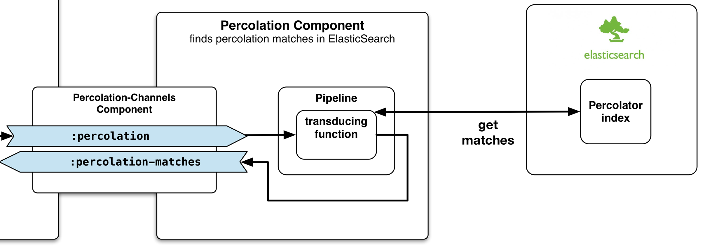

## TwitterClient - Percolation Component

The Percolation Component is responsible for matching new tweets with existing queries. Remember, in this application, we update the search results shown in the client in (near-)real time when new matches are available. In order to do that, we need some kind of matching mechanism between searches and new items.

This is where ElasticSearch's **[Percolator feature](http://www.elasticsearch.org/guide/en/elasticsearch/reference/current/search-percolate.html)** helps. Percolation queries are kind of reverse searches that allow the registration of an observing real-time search in the percolation index. Each new tweet is then presented to the percolation index in ElasticSearch to determine which of the registered searches match on the new item.

The registration of queries in the percolation index and the delivery happens in the percolation component of the **client-facing application** and will be covered in more detail there. Here, you just need to know that upon registering a search, a hash of the query is used as the ID so that any possible query is only ever registered once.



In this component, new tweets are matched against existing searches, which returns a sequence of matching query IDs. New tweets are received on the ````:percolation```` channel and results (tweet with set of matches) are put on the ````:percolation-matches```` channel from the Percolation-Channels component. Here's the **[component itself](https://github.com/matthiasn/BirdWatch/blob/5fe69fbfaa956039e1f89a26811d0c86775dd594/Clojure-Websockets/TwitterClient/src/clj/birdwatch_tc/percolator/component.clj)**:

~~~
(ns birdwatch-tc.percolator.component
  (:gen-class)
  (:require
   [birdwatch-tc.percolator.elastic :as es]
   [clojure.tools.logging :as log]
   [pandect.core :refer [sha1]]
   [clojure.pprint :as pp]
   [clojurewerkz.elastisch.rest :as esr]
   [com.stuartsierra.component :as component]
   [clojure.core.async :as async :refer [chan tap pipeline-blocking]]))

(defrecord Percolator [conf channels]
  component/Lifecycle
  (start [component] (log/info "Starting Percolator Component")
         (let [conn (esr/connect (:es-address conf))
               perc-matches-chan (:percolation-matches channels)
               perc-chan (:percolation channels)]
           (pipeline-blocking 2 perc-matches-chan (es/percolation-xf conn) perc-chan)
           (assoc component :conn conn)))
  (stop [component] (log/info "Stopping Percolator Component") ;; TODO: proper teardown of resources
        (assoc component :conn nil)))

(defn new-percolator [conf] (map->Percolator {:conf conf}))

(defrecord Percolation-Channels []
  component/Lifecycle
  (start [component] (log/info "Starting Percolation Channels Component")
         (assoc component :percolation (chan) :percolation-matches (chan)))
  (stop [component] (log/info "Stop Percolation Channels Component")
        (assoc component :percolation nil :percolation-matches nil)))

(defn new-percolation-channels [] (map->Percolation-Channels {}))
~~~

The component follows the pattern of creating ````defrecord````s for the component itself plus an associated channels component in the same way that we've seen already. You may not have seen **pipeline-blocking** yet, so let me explain. A **[pipeline](https://clojure.github.io/core.async/#clojure.core.async/pipeline)** is a **core.async** construct that we can use when we want to take something off a channel, process it and put the result onto another channel, all potentially in parallel. In this case, we use two parallel blocking pipelines since querying ElasticSearch here is a blocking operation and we want to be able to run two in parallel at any moment.

All we need to supply to the pipeline is a **[transducing function](https://github.com/matthiasn/BirdWatch/blob/5fe69fbfaa956039e1f89a26811d0c86775dd594/Clojure-Websockets/TwitterClient/src/clj/birdwatch_tc/percolator/elastic.clj)**, which we look at next:

~~~
(ns birdwatch-tc.percolator.elastic
  (:gen-class)
  (:require
   [clojure.tools.logging :as log]
   [pandect.core :refer [sha1]]
   [clojure.pprint :as pp]
   [clojurewerkz.elastisch.rest.percolation :as perc]
   [clojurewerkz.elastisch.rest.response :as esrsp]))

(defn percolation-xf
  "create transducer for performing percolation"
  [conn]
  (map (fn [t]
         (let [response (perc/percolate conn "percolator" "tweet" :doc t)
               matches (set (map :_id (esrsp/matches-from response)))] ;; set with SHAs
           [t matches]))))
~~~

So here's what this function does. For every element (which we know is a tweet) that the pipeline construct processes by using the transducing function, we pass the item to the percolator, which first gives us a response. We then use ````esrsp/matches-from```` to retrieve the actual matches, use ````map```` to only get the ````:_id```` from each match and create a ````set```` from these matches.

Finally, we create a ````vector```` that contains the set and the actual tweet: ````[t matches]````. This result vector is what we finally put on the ````:percolation-matches```` channel.

Note that this component knows nothing about any other part of the program. The transducer does not even know the target channel; it is only concerned with the actual processing step.
